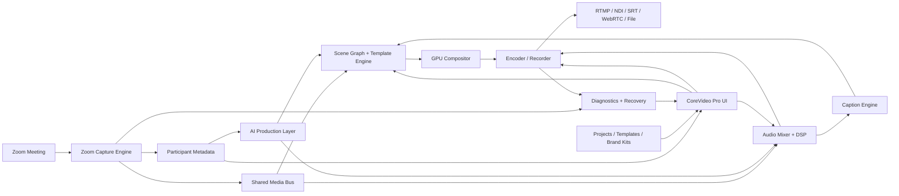

# CoreVideo Pro Product Spec and MVP Plan

## Name, Tagline, and Positioning

### CoreVideo Pro

Tagline: **Pro Zoom productions in minutes, not hours.**

Positioning: **CoreVideo Pro is a cross-platform, Zoom-native live production studio that turns remote participants into polished streams, webinars, interviews, and recordings with AI-assisted layouts, captions, lower-thirds, audio cleanup, and pro output built in.**

CoreVideo Pro competes directly with MimoLive, Ecamm, and vMix, but its wedge is narrower and stronger: it is the fastest way to create a professional show from Zoom participants without screen-capture hacks, complex switcher setup, or manual scene building.

## Product Thesis

Remote production is still too technical. vMix is powerful but intimidating. Ecamm is friendly but less flexible and Mac-focused. MimoLive is capable but more traditional than AI-native. CoreVideo Pro should win by making Zoom production feel automatic while preserving real production depth.

The product promise:

> Join Zoom, click Magic Scene, review the auto-built show, then stream or record.

CoreVideo Pro is not an OBS companion and has no OBS dependency. It owns the full production stack:

- Zoom-native capture.
- Participant metadata.
- Scene layout.
- AI auto-production.
- GPU compositing.
- Audio processing.
- Captions and overlays.
- Streaming and recording.
- NDI, SRT, WebRTC, and RTMP output.

## Game-Changing Differentiators

### 1. True Zoom-Native SDK Integration

CoreVideo Pro joins Zoom directly through the Zoom Meeting SDK and captures clean participant video, audio, screen share, and metadata. The app should not rely on window capture, virtual cameras, display capture, or manually cropping Zoom gallery views.

Core data model:

- Participant video feed.
- Participant audio feed.
- Display name.
- Role: host, co-host, panelist, guest, presenter.
- Talking state.
- Mute state.
- Video state.
- Screen-share state.
- Spotlight state where available.
- Breakout room state where available.
- Network/feed quality.

### 2. AI Auto-Production

The app should act like an assistant producer.

MVP capabilities:

- Real-time active speaker detection with debounce and hold timing.
- Auto layout selection from participant count, roles, and screen-share state.
- Dynamic lower-thirds from participant names and roles.
- "Set & Forget" mode that runs the show automatically.
- Manual overrides for scene, speaker, crop, audio, captions, and overlays.

### 3. Smart Participant Handling

Each participant should be treated as a production-ready person, not a raw feed.

MVP capabilities:

- Face-aware auto-crop and framing.
- Per-person gain leveling.
- Noise suppression.
- Mute/talking state awareness.
- Speaker hold to avoid rapid cuts.
- Fallback behavior when video drops.
- Breakout room awareness as a Phase 2 priority unless SDK access is straightforward in MVP.

### 4. Template Intelligence and Magic Scene

The **Magic Scene** button is the signature workflow.

Magic Scene should:

- Detect participant count.
- Detect roles.
- Detect screen share.
- Detect active speaker.
- Choose the best template.
- Fill participant slots.
- Add lower-thirds.
- Apply brand kit.
- Add captions and overlays.
- Produce a ready-to-stream scene set.

The operator can accept, edit, or regenerate.

### 5. Real-Time AI Captions and Adaptive Overlays

Captions and overlays should be production elements, not afterthoughts.

MVP:

- Real-time captions for program audio.
- Caption style controls.
- Speaker name attribution where confidence is high.
- Adaptive lower-third placement to avoid covering captions.
- Overlay warnings when graphics collide with faces or captions.

Phase 2:

- Per-speaker captions.
- Translation captions.
- Topic-aware overlays.
- Auto chapter markers.

### 6. Native Pro Output

CoreVideo Pro must output like professional software:

- RTMP in MVP.
- Local recording in MVP.
- NDI output in MVP if licensing and implementation fit; otherwise Phase 2 early.
- SRT in Phase 2 early.
- WebRTC output for low-latency remote monitoring or contribution in Phase 2.
- Hardware-accelerated encode and render from day one.

## Target Users

Primary:

- Webinar producers.
- Podcast and interview creators.
- B2B marketing teams.
- Corporate communications teams.
- Course creators.
- Event agencies.
- Consultants and coaches running polished live sessions.

Secondary:

- Hybrid event teams.
- Churches and nonprofits.
- Education teams.
- Production contractors who need fast remote show setup.

## Prioritized MVP Feature List: 8-12 Weeks

### P0: Zoom-Native Capture

- Join Zoom by URL, meeting ID, or scheduled meeting.
- OAuth/sign-in flow appropriate for Zoom Meeting SDK requirements.
- Clean participant video for up to 6 participants.
- Clean participant audio where SDK entitlement permits.
- Active screen-share capture.
- Participant metadata roster.
- Active speaker detection.
- Feed health tracking:
  - waiting.
  - live.
  - stale.
  - low resolution.
  - muted.
  - video off.
  - disconnected.
  - recovering.
- Automatic reconnect and recovery.

### P0: Magic Scene

- One-click scene generation.
- Auto-select templates from participant count and roles.
- Auto-fill participant slots.
- Auto-add screen share when present.
- Auto-add lower-thirds.
- Auto-apply brand kit.
- Auto-generate intro, main, screen-share, panel, and closing scenes.
- Regenerate scene set without destroying manual edits unless confirmed.

### P0: AI Auto-Production

- Set & Forget mode.
- Active speaker focus.
- Auto layout changes when screen share starts/stops.
- Auto lower-third reveal for newly featured speakers.
- Speaker hold/sensitivity controls.
- Manual take/release override.
- Role priority:
  - host preferred for intros/outros.
  - presenter preferred during screen share.
  - active speaker preferred during discussion.

### P0: Smart Participant Handling

- Face-aware auto-crop.
- Centering and headroom adjustment.
- Per-person audio leveling.
- Noise suppression toggle.
- Per-person mute/solo.
- Video-off placeholder.
- Low-quality feed warning.
- Manual crop override.

### P0: Scene Builder

- Preview/program canvas.
- Drag-and-drop sources.
- Resize, crop, position, and layer.
- Snap alignment.
- Scene list.
- Scene duplicate.
- Scene transitions:
  - cut.
  - fade.
  - push.
- Template slots:
  - fixed participant.
  - active speaker.
  - role-based participant.
  - screen share.
  - gallery.

### P0: Template Library

MVP templates:

- Solo speaker.
- Two-person interview.
- Two-person picture-in-picture.
- Three-person feature.
- Four-person grid.
- Six-person panel.
- Active speaker plus gallery.
- Host plus screen share.
- Presenter plus slides.
- Podcast duo.
- Webinar intro.
- Webinar outro.

### P0: Graphics, Lower-Thirds, and Captions

- Logo upload.
- Brand color.
- Background image.
- Lower-third templates.
- Auto lower-thirds from Zoom names.
- Manual name/title override.
- Text overlays.
- Image overlays.
- Countdown timer.
- Real-time program captions.
- Caption style controls.
- Adaptive placement to avoid lower-third/caption collisions.

### P0: Audio Mixer

- Per-participant gain.
- Auto leveling.
- Noise suppression.
- Mute/solo.
- Master meter.
- Output limiter.
- Clipping warning.
- Audio sync offset.

### P0: Output

- Local MP4 recording.
- RTMP streaming.
- YouTube preset.
- Twitch preset.
- Custom RTMP preset.
- 1080p output.
- 30/60 fps options where hardware permits.
- Hardware H.264 encoding:
  - Windows: NVENC, Intel Quick Sync, AMD AMF.
  - macOS: VideoToolbox.
- Output health:
  - bitrate.
  - dropped frames.
  - encoder load.
  - network warning.
  - disk-space warning.

### P1 During MVP If Time Allows

- NDI program output.
- SRT output.
- ISO recording for participant feeds.
- Virtual camera output.
- Per-speaker caption attribution.
- Stream Deck/Companion control API.

## Recommended Tech Stack

### Desktop App

Recommended: **Qt 6 + C++/QML**.

Reasons:

- Cross-platform Mac and Windows desktop support.
- Strong fit for native media SDKs.
- Good performance and packaging control.
- Lower friction with Zoom Meeting SDK, NDI, hardware encoders, and platform audio/video APIs.

Alternative: **Tauri + React/TypeScript UI + Rust/C++ media core**.

Use this only if the team prioritizes web UI iteration and is comfortable maintaining native bridges for all media paths.

Architectural constraint: Electron, Tauri, React, or any web renderer may host the operator interface, but must not own the real-time media pipeline. Direct Zoom media ingest, frame transforms, chroma key, scene graph rendering, overlays, audio mixing, recording, ISO capture, and streaming must live in a native media core behind typed IPC.

### Media Core

- C++20 native engine.
- Dedicated Zoom capture process.
- Shared-memory or GPU-texture transport between capture and compositor.
- GPU compositor:
  - Windows: Direct3D 11/12.
  - macOS: Metal.
- FFmpeg/libav or GStreamer for recording, muxing, and streaming.
- Hardware encoding:
  - NVENC.
  - Quick Sync.
  - AMF.
  - VideoToolbox.

### Zoom Layer

- Zoom Meeting SDK.
- Raw video APIs.
- Raw audio APIs where permitted.
- Screen-share capture.
- OAuth/PKCE for account authorization.
- Entitlement checks at startup.
- Dedicated SDK engine process for crash isolation.

### AI Layer

MVP local-first:

- Active speaker logic from Zoom metadata plus local audio levels.
- Face detection using MediaPipe, OpenCV, Apple Vision, or Windows ML.
- Rule-based layout intelligence.
- Local audio leveling and noise suppression.

Captions:

- MVP option A: local Whisper-derived model if latency and hardware are acceptable.
- MVP option B: cloud streaming transcription for better real-time quality.
- Product recommendation: support cloud captions first for quality, with local captions as a privacy-focused Phase 2 option.

Phase 2:

- Auto-director models trained on production heuristics.
- Transcript summaries.
- Clip suggestions.
- Translation captions.
- Brand-aware graphics generation.

### Output Layer

- RTMP in MVP.
- Local MP4/MOV recording in MVP.
- NDI SDK for NDI output.
- libsrt for SRT.
- WebRTC stack for low-latency program monitoring and remote producer workflows.

### Backend

MVP backend should stay small:

- User accounts.
- License/subscription.
- Template library.
- Crash/error reporting.
- Optional cloud caption service broker.

Suggested stack:

- Postgres/Supabase or small Node/FastAPI service.
- Stripe billing.
- S3/R2 asset storage.

## High-Level Architecture

## Zoom Capture Data Flow

1. User signs in and joins a Zoom meeting.
2. Dedicated Zoom engine process initializes the Meeting SDK.
3. Engine subscribes to participant video, audio, screen share, and metadata.
4. Raw frames and PCM audio move into the shared media bus.
5. Metadata updates participant roster, roles, active speaker, and health.
6. AI Production Layer evaluates layout, crop, speaker focus, captions, and audio levels.
7. Scene Graph maps participants into templates.
8. GPU Compositor renders preview and program.
9. Audio Mixer outputs mastered program audio.
10. Encoder records locally and streams to selected destinations.

## UI/UX Flow

### First Run

1. User opens CoreVideo Pro.
2. App checks hardware, camera/audio permissions, network, and encoder support.
3. User signs in to Zoom.
4. User creates a brand kit or skips with defaults.

### New Production

User chooses:

- Webinar.
- Interview.
- Podcast.
- Panel.
- Presentation.

Then joins Zoom by pasting a link or selecting a scheduled meeting.

### Magic Scene

After participants appear, the app shows a prominent **Magic Scene** button.

When clicked, CoreVideo Pro:

- Detects participant count.
- Detects roles.
- Detects screen-share state.
- Chooses scene templates.
- Maps people to slots.
- Adds captions.
- Adds lower-thirds.
- Applies brand kit.
- Creates a scene list.

The user sees a review screen:

- Accept.
- Regenerate.
- Edit manually.

### Live Production View

Primary regions:

- Left: scenes and Magic Scene suggestions.
- Center: preview/program canvas.
- Right: participants, roles, graphics, captions, and properties.
- Bottom: audio mixer, record/stream controls, health.

Primary controls:

- Take.
- Record.
- Stream.
- Magic Scene.
- Set & Forget.
- Override speaker.
- Show lower-third.

### Set & Forget Mode

Set & Forget mode runs a lightweight auto-director:

- Switches to screen-share layout when sharing starts.
- Features active speaker during discussion.
- Holds shots long enough to avoid jitter.
- Shows lower-third when someone first becomes featured.
- Returns to host or panel layout when discussion settles.

Operator overrides always win and can be released back to automation.

## Template System

### Template Objects

Each template contains:

- Canvas size.
- Slot definitions.
- Slot assignment rules.
- Safe regions.
- Lower-third region.
- Caption region.
- Overlay layers.
- Transition defaults.
- Brand token bindings.
- Automation hints.

### Slot Assignment Rules

Supported slot types:

- Fixed participant.
- Host.
- Co-host.
- Presenter.
- Active speaker.
- Recent speaker.
- Screen share.
- Gallery.
- Empty/fallback.

### Template Intelligence

Template selection considers:

- Participant count.
- Roles.
- Active speaker.
- Screen share.
- Video availability.
- Face positions.
- Brand kit.
- Output aspect ratio.
- Caption visibility.

## Competitive Matrix

| Capability | CoreVideo Pro | vMix | Ecamm | MimoLive |
|---|---:|---:|---:|---:|
| Clean Zoom-native participant feeds | Excellent, core workflow | Strong | Good | Strong |
| No capture hacks required | Yes | Yes for supported Zoom paths | Partial/workflow-dependent | Yes for supported Zoom paths |
| Beginner-friendly setup | Excellent | Weak | Strong | Medium |
| AI auto-production | Excellent | Limited | Limited | Limited |
| Magic auto-built scenes | Core feature | No | Limited | Limited |
| Dynamic lower-thirds from Zoom metadata | Core feature | Manual/advanced | Partial/manual | Manual/advanced |
| Smart participant framing | Core feature | Manual/advanced | Limited | Manual/advanced |
| Per-person audio leveling | Core feature | Advanced/manual | Good/basic | Advanced/manual |
| Real-time AI captions/overlays | Core feature | External/manual | Limited | External/manual |
| Pro scene depth | Strong | Excellent | Medium | Strong |
| Cross-platform Mac + Windows | Yes | Windows-first | Mac-focused | Mac-focused |
| NDI/SRT/WebRTC | Native roadmap | Strong | Limited/good depending output | Strong NDI |
| Best for Zoom-based remote shows | Yes | Powerful but complex | Easy but less flexible | Capable but less AI-native |

## How CoreVideo Pro Wins

Against vMix:

- Much simpler setup.
- Zoom participant handling is the primary workflow, not one input category.
- AI Auto-Production removes manual scene switching for common shows.
- Better fit for marketers, podcasters, and webinar teams.

Against Ecamm:

- Cross-platform.
- More flexible scene and output architecture.
- More scalable participant handling.
- Stronger AI automation and metadata-driven templates.

Against MimoLive:

- More modern AI-native workflow.
- Faster show creation.
- Magic Scene makes the first polished output nearly instant.
- More focused on Zoom participant production as the killer feature.

## Roadmap

### Phase 0: Technical Validation

- Validate Zoom SDK raw video/audio entitlements.
- Validate participant count and bandwidth limits.
- Validate macOS and Windows hardware encode paths.
- Validate caption latency and cost.
- Validate NDI/SRT/WebRTC implementation choices.

### Phase 1: MVP

- Zoom-native capture.
- Magic Scene.
- 1080p local recording.
- RTMP streaming.
- AI Auto-Production basics.
- Smart framing.
- Lower-thirds.
- Captions.
- Audio leveling/noise suppression.
- Template system.
- Diagnostics.

### Phase 2: Pro Expansion

- 4K output.
- NDI output.
- SRT output.
- WebRTC monitor output.
- ISO recording.
- Multitrack audio.
- Virtual camera.
- Advanced graphics.
- Stingers.
- LUTs.
- Media bins.
- Stream Deck and Companion integrations.

### Phase 3: AI Studio

- Full auto-director.
- Per-speaker captions.
- Translation captions.
- Auto highlights.
- Clips and chapters.
- Transcript and show notes.
- Brand-aware graphic generation.
- AI rundown generation.

### Phase 4: Team and Enterprise

- Team workspaces.
- Shared brand kits.
- Shared templates.
- Remote producer mode.
- Cloud sync.
- Role-based access.
- SSO.
- Admin controls.
- Compliance package.

## Monetization

### Free Trial

- 14 days.
- Watermark after 30 minutes.
- 720p output limit.

### Creator: $19/month

- 1080p recording.
- RTMP streaming.
- Basic Magic Scene.
- Basic captions.
- Brand kit.
- Up to 4 Zoom participants.

### Pro: $49/month

- Up to 8 Zoom participants.
- Advanced Magic Scene.
- Set & Forget mode.
- Advanced captions.
- Chroma key.
- Audio leveling/noise suppression.
- Multi-destination when available.
- NDI/SRT when available.
- Priority support.

### Team: $99/month/workspace + seats

- Shared templates.
- Shared brand kits.
- Team roles.
- Cloud sync.
- Remote producer features.
- Central billing.

### Enterprise

- SSO.
- Admin controls.
- Deployment management.
- Compliance review.
- Dedicated support.
- SLA.
- Custom templates and workflows.

## 8-12 Week MVP Plan

### Weeks 1-2: Capture and Architecture

- Build app shell.
- Implement dedicated Zoom capture process.
- Join Zoom meeting.
- Receive participant metadata.
- Receive raw participant video and audio.
- Prototype shared media bus.
- Validate entitlements and bandwidth behavior.

### Weeks 3-4: Compositor and Audio

- Render multiple Zoom feeds to GPU canvas.
- Implement basic scene graph.
- Implement program/preview.
- Implement audio mixer.
- Add gain leveling and limiter.
- Add feed health.

### Weeks 5-6: Magic Scene and Templates

- Build template schema.
- Implement 1-up, 2-up, 3-up, 4-up, screen-share templates.
- Implement Magic Scene participant mapping.
- Add lower-thirds from Zoom names.
- Add brand kit basics.

### Weeks 7-8: Output

- Local MP4 recording.
- RTMP streaming.
- YouTube/Twitch/custom RTMP presets.
- Hardware H.264 encode.
- Output health dashboard.
- Recording/streaming controls.

### Weeks 9-10: AI Production

- Active speaker auto-director.
- Set & Forget mode.
- Face-aware smart crop.
- Screen-share auto layout switching.
- Real-time captions.
- Adaptive lower-third/caption placement.

### Weeks 11-12: Polish and Beta

- Onboarding.
- Installer/signing.
- Crash recovery.
- Diagnostics bundle.
- Performance tuning.
- Real webinar/interview beta runs.
- Documentation and pricing page draft.

## MVP Exit Criteria

- User can join Zoom and see clean participant feeds.
- User can click Magic Scene and get a polished show in under 10 minutes.
- User can run a 4-person webinar with screen share, lower-thirds, captions, and audio leveling.
- User can record a stable 1080p MP4.
- User can stream to RTMP.
- Set & Forget mode can produce a basic interview or webinar without constant operator input.
- Manual overrides always work.
- App has no dependency on OBS.
