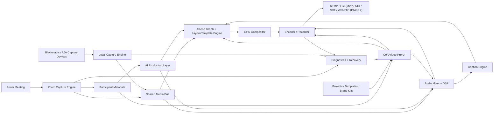

# CoreVideo Pro Product Spec and MVP Plan

## Name, Tagline, and Positioning

### CoreVideo Pro

Tagline: **Pro Zoom productions in minutes, not hours.**

Positioning: **CoreVideo Pro is a cross-platform, Zoom-native live production studio that turns remote participants and local pro cameras into polished streams, webinars, interviews, and recordings with AI-assisted layouts, captions, lower-thirds, audio cleanup, and pro output built in.**

CoreVideo Pro competes directly with MimoLive, Ecamm, and vMix, but its wedge is narrower and stronger: it is the fastest way to create a professional show from Zoom participants - optionally mixed with local Blackmagic/AJA capture sources - without screen-capture hacks, complex switcher setup, or manual scene building.

Ruthless simplicity is a product requirement, not a phase-1 compromise: every feature must earn its place in the UI by reducing operator effort, not adding configuration surface.

## Product Thesis

Remote production is still too technical. vMix is powerful but intimidating, with a dense multi-window UI built for full-time switchers. Ecamm is friendly but less flexible, Mac-only, and treats Zoom as one input among many rather than the core workflow. MimoLive is capable and pro-grade (layers, NDI, PTZ, ISO recording, remote surfaces) but that depth comes at the cost of a steep learning curve and traditional, non-AI-native production thinking.

CoreVideo Pro's bet: most Zoom-based shows (webinars, interviews, panels, podcasts) need 80% of MimoLive's output quality with 20% of its complexity, plus AI automation MimoLive doesn't attempt. We deliberately do not chase MimoLive's full layer-compositing depth, NDI ecosystem, PTZ camera control, multi-track ISO recording, or remote producer surfaces in the MVP - those are Phase 2+ if validated by demand. Instead we win on:

1. The cleanest Zoom-native multi-participant capture and metadata pipeline in the category.
2. AI auto-production (speaker detection, layout switching, lower-thirds, captions) that runs the show with minimal operator input.
3. A hybrid model where one or two local Blackmagic/AJA capture devices slot in as first-class sources alongside Zoom feeds - useful for a host's pro camera/mic chain - without requiring a full hardware switcher workflow.

The product promise:

> Join Zoom (and plug in a camera if you have one), click Magic Scene, review the auto-built show, then stream or record.

CoreVideo Pro is not an OBS companion and has no OBS dependency. It owns the full production stack:

- Zoom-native capture.
- Local Blackmagic/AJA capture device sources.
- Participant metadata.
- Scene layout.
- AI auto-production.
- GPU compositing.
- Audio processing (Zoom + local sources).
- Captions and overlays.
- Streaming and recording.
- RTMP output in MVP; NDI, SRT, and WebRTC as roadmap output options.

## Game-Changing Differentiators

### 1. True Zoom-Native SDK Integration

CoreVideo Pro joins Zoom directly through the Zoom Meeting SDK and captures clean participant video, audio, screen share, and metadata. The app should not rely on window capture, virtual cameras, display capture, or manually cropping Zoom gallery views.

Core data model:

- Participant video feed.
- Participant audio feed.
- Display name.
- Role: host, co-host, panelist, guest, presenter.
- Talking state.
- Mute state.
- Video state.
- Screen-share state.
- Spotlight state where available.
- Breakout room state where available.
- Network/feed quality.

### 2. AI Auto-Production

The app should act like an assistant producer.

MVP capabilities:

- Real-time active speaker detection with debounce and hold timing.
- Auto layout selection from participant count, roles, and screen-share state.
- Dynamic lower-thirds from participant names and roles.
- "Set & Forget" mode that runs the show automatically.
- Manual overrides for scene, speaker, crop, audio, captions, and overlays.

### 3. Smart Participant Handling

Each participant should be treated as a production-ready person, not a raw feed.

MVP capabilities:

- Face-aware auto-crop and framing.
- Per-person gain leveling.
- Noise suppression.
- Mute/talking state awareness.
- Speaker hold to avoid rapid cuts.
- Fallback behavior when video drops.
- Breakout room awareness as a Phase 2 priority unless SDK access is straightforward in MVP.

### 4. Template Intelligence and Magic Scene

The **Magic Scene** button is the signature workflow.

Magic Scene should:

- Detect participant count.
- Detect roles.
- Detect screen share.
- Detect active speaker.
- Choose the best template.
- Fill participant slots.
- Add lower-thirds.
- Apply brand kit.
- Add captions and overlays.
- Produce a ready-to-stream scene set.

The operator can accept, edit, or regenerate.

### 5. Real-Time AI Captions and Adaptive Overlays

Captions and overlays should be production elements, not afterthoughts.

MVP:

- Real-time captions for program audio.
- Caption style controls.
- Speaker name attribution where confidence is high.
- Adaptive lower-third placement to avoid covering captions.
- Overlay warnings when graphics collide with faces or captions.

Phase 2:

- Per-speaker captions.
- Translation captions.
- Topic-aware overlays.
- Auto chapter markers.

### 6. Native Pro Output

CoreVideo Pro must output like professional software:

- RTMP in MVP.
- Local recording in MVP.
- NDI output in MVP if licensing and implementation fit; otherwise Phase 2 early.
- SRT in Phase 2 early.
- WebRTC output for low-latency remote monitoring or contribution in Phase 2.
- Hardware-accelerated encode and render from day one.

### 7. Hybrid Local Capture: Blackmagic and AJA Devices

CoreVideo Pro treats one or two local capture devices as first-class sources that mix directly with Zoom participant feeds in the same scene graph - no separate switcher, no NDI bridge, no virtual camera round-trip required.

Core capabilities:

- Auto-detect connected Blackmagic DeckLink/UltraStudio and AJA Io/Kona devices on app launch and hot-plug.
- Per-device input selection (SDI/HDMI, resolution, frame rate, color space) with sensible auto-detected defaults.
- Local capture sources appear in the same source list as Zoom participants and can fill any template slot (host cam, cutaway, B-roll).
- Per-source audio: embedded SDI/HDMI audio or a separate audio device, routed into the same audio mixer as Zoom participant audio.
- Low end-to-end latency (target sub-100ms capture-to-preview) with a manual A/V sync offset control to align local camera audio/video against Zoom audio.
- Source health: signal-present, format mismatch, dropped-frame, and device-disconnected states surfaced like Zoom feed health.

Explicitly out of scope for MVP (MimoLive-style depth we are not chasing yet): multi-camera PTZ control, NDI source/output, simultaneous multi-device ISO recording, and remote producer/contribution surfaces. A single local capture source (most commonly the host's camera) covers the dominant "Zoom-plus-host-cam" use case; multi-device support is a Phase 2 expansion once core demand is validated.

## Target Users

Primary:

- Webinar producers.
- Podcast and interview creators.
- B2B marketing teams.
- Corporate communications teams.
- Course creators.
- Event agencies.
- Consultants and coaches running polished live sessions.

Secondary:

- Hybrid event teams.
- Churches and nonprofits.
- Education teams.
- Production contractors who need fast remote show setup.

## Prioritized MVP Feature List: 8-12 Weeks

The MVP is ordered to de-risk the hardest integration first (Zoom SDK), then layer automation, layouts, branding, audio, output, and finally polish the UI down to something genuinely minimalist. Local capture device support rides alongside Zoom capture as a parallel-but-secondary P0 track once the Zoom pipeline is stable.

### P0-1: Zoom SDK Clean Integration + Metadata

- Join Zoom by URL, meeting ID, or scheduled meeting.
- OAuth/sign-in flow appropriate for Zoom Meeting SDK requirements.
- Clean participant video for up to 6 participants, no window-capture hacks.
- Clean participant audio where SDK entitlement permits.
- Active screen-share capture.
- Participant metadata roster: display name, role (host/co-host/panelist/guest/presenter), mute state, video state, talking state.
- Feed health tracking: waiting, live, stale, low resolution, muted, video off, disconnected, recovering.
- Automatic reconnect and recovery.
- Dedicated SDK process/thread for crash isolation from the renderer.

### P0-2: Active Speaker Detection + Automatic Layout Switching

- Real-time active speaker detection from Zoom metadata plus local audio levels, with debounce and hold timing.
- Automatic layout switching when the active speaker changes, screen share starts/stops, or participant count changes.
- Speaker hold/sensitivity controls to avoid rapid cuts.
- Manual take/release override that always wins over automation, with one-click "return to auto."
- Role priority for automated decisions: host preferred for intros/outros, presenter preferred during screen share, active speaker preferred during discussion.
- This is the "Set & Forget" mode: once enabled, the show runs itself.

### P0-3: Core Layouts (Grid, Speaker Focus, Picture-in-Picture)

- Grid layout: even tiling for 2-6 participants, auto-reflow as participants join/leave.
- Speaker focus layout: one large active-speaker tile plus a thumbnail strip of other participants.
- Picture-in-picture layout: primary source (screen share or speaker) with a small inset for a second source (host cam or local capture device).
- Layouts are the rendering primitives that templates and Magic Scene compose from - keep this set small and orthogonal.
- Smooth cut/fade transitions between layouts.

### P0-4: Dynamic Lower Thirds from Zoom Data

- Auto-generate lower-thirds from Zoom participant display name and role with zero manual entry.
- Manual name/title override per participant for cases where Zoom display names aren't presentation-ready.
- Auto-reveal lower-third when a participant first becomes featured (active speaker focus or PIP).
- Auto-hide on a timer or when the participant is no longer featured.
- Adaptive placement to avoid covering captions or other overlays.
- Brand-styled template (logo, color, font) applied automatically.

### P0-5: 3-5 Professional Templates with One-Click Apply

MVP template set (deliberately small - "3-5", not 12):

- Solo speaker / presenter.
- Two-person interview (side-by-side or speaker-focus + PIP).
- Podcast/panel grid (3-6 participants).
- Screen share + presenter (host plus slides).
- Webinar intro/outro (branded title card with lower-thirds for hosts).

Each template is a one-click apply: selecting it maps current participants into slots by role/active-speaker rules, applies the brand kit, and adds the appropriate lower-thirds - this is the "Magic Scene" workflow, scoped to a small, polished template set rather than a sprawling library.

### P0-6: Local Capture Devices - Blackmagic and AJA

- Auto-detect connected Blackmagic DeckLink/UltraStudio and AJA Io/Kona devices on launch and hot-plug.
- Per-device input selection (SDI/HDMI port, resolution, frame rate, color space) with auto-detected defaults.
- Local capture source appears in the same source list as Zoom participants and can fill any layout/template slot.
- Source health: signal-present, format mismatch, dropped-frame, device-disconnected.
- Manual A/V sync offset to align local camera audio against Zoom audio.
- MVP target: reliable support for one local capture device (the common "Zoom plus host cam" case); a second simultaneous device is a stretch goal, not a blocker.

### P0-7: Per-Participant Audio Mixing + Basic Noise Suppression

- Per-participant (Zoom and local capture) gain control.
- Auto leveling so participants sound balanced without manual mixing.
- Basic noise suppression toggle per source.
- Per-person mute/solo.
- Master output meter with limiter and clipping warning.
- Audio sync offset for local capture sources.

### P0-8: Recording + Streaming (YouTube, RTMP)

- Local MP4 recording, 1080p, 30/60fps where hardware permits.
- RTMP streaming with a YouTube preset (pre-filled ingest URL, stream key field) and a generic custom RTMP preset.
- Hardware H.264 encoding: Windows (NVENC, Quick Sync, AMF), macOS (VideoToolbox).
- Output health: bitrate, dropped frames, encoder load, network warning, disk-space warning.
- Start/stop record and stream from one primary control, with clear armed/live state.

### P0-9: Minimalist Drag-and-Drop UI

- Single main window: program/preview canvas, source list (Zoom participants + local capture), template picker, and record/stream controls - no multi-window switcher complexity.
- Drag sources onto layout slots; drag to reorder/replace.
- One-click Magic Scene / template apply, one-click Set & Forget toggle, one-click record/stream.
- Real-time captions and lower-thirds rendered directly in the canvas with adaptive placement to avoid collisions.
- Every advanced control (manual crop, gain, sync offset) lives in a collapsible per-source panel - hidden by default, available in one click.

### P1 During MVP If Time Allows

- Smart participant handling depth: face-aware auto-crop, centering/headroom adjustment, low-quality feed warning, manual crop override.
- Real-time AI captions with caption style controls.
- Brand kit manager (logo upload, brand color, background).
- Twitch preset and additional custom RTMP presets.
- Second local capture device support.
- Per-speaker caption attribution.

### Phase 2+ (Not in MVP, MimoLive-style depth deferred intentionally)

- NDI input/output.
- SRT output.
- WebRTC monitoring/contribution output.
- PTZ camera control.
- Multi-device ISO recording.
- Remote producer/contribution surfaces.
- Stream Deck/Companion control API.
- Virtual camera output.

## Recommended Tech Stack

### Desktop App

Recommended: **Qt 6 + C++/QML**.

Reasons:

- Cross-platform Mac and Windows desktop support.
- Strong fit for native media SDKs.
- Good performance and packaging control.
- Lower friction with Zoom Meeting SDK, NDI, hardware encoders, and platform audio/video APIs.

Alternative: **Tauri + React/TypeScript UI + Rust/C++ media core**.

Use this only if the team prioritizes web UI iteration and is comfortable maintaining native bridges for all media paths.

Architectural constraint: Electron, Tauri, React, or any web renderer may host the operator interface, but must not own the real-time media pipeline. Direct Zoom media ingest, frame transforms, chroma key, scene graph rendering, overlays, audio mixing, recording, ISO capture, and streaming must live in a native media core behind typed IPC.

### Media Core

- C++20 native engine.
- Dedicated Zoom capture process.
- Shared-memory or GPU-texture transport between capture and compositor.
- GPU compositor:
  - Windows: Direct3D 11/12.
  - macOS: Metal.
- FFmpeg/libav or GStreamer for recording, muxing, and streaming.
- Hardware encoding:
  - NVENC.
  - Quick Sync.
  - AMF.
  - VideoToolbox.

### Zoom Layer

- Zoom Meeting SDK.
- Raw video APIs.
- Raw audio APIs where permitted.
- Screen-share capture.
- OAuth/PKCE for account authorization.
- Entitlement checks at startup.
- Dedicated SDK engine process for crash isolation.

### Local Capture Layer: Blackmagic and AJA

- **Blackmagic DeckLink SDK** for DeckLink/UltraStudio device enumeration, format detection, and frame callbacks on both Windows and macOS.
- **AJA NTV2 SDK (AJA Software Development Kit)** for Io/Kona device support, mirroring the same enumeration/format/frame-callback model.
- A thin "capture device" abstraction in the native media core normalizes both SDKs to a common frame + audio buffer interface, so the compositor and audio mixer don't need to know which vendor is in use.
- Capture runs in the same native media core process as the GPU compositor (not a separate IPC hop) to keep capture-to-preview latency low; device enumeration/hot-plug events are pushed to the renderer over the typed IPC bridge.
- Format negotiation: auto-detect input signal format/resolution/frame rate on connect; surface a manual override in the UI for edge cases (e.g., odd frame rates, color space mismatches).
- Frame timestamps from capture hardware feed the same A/V sync pipeline used for Zoom audio, enabling the manual sync-offset control.
- Both SDKs are free to integrate (no royalty), but require their own redistributable drivers (Desktop Video for Blackmagic, AJA drivers) - document as a one-time host setup step, not an in-app download.

### AI Layer

MVP local-first:

- Active speaker logic from Zoom metadata plus local audio levels.
- Face detection using MediaPipe, OpenCV, Apple Vision, or Windows ML.
- Rule-based layout intelligence.
- Local audio leveling and noise suppression.

Captions:

- MVP option A: local Whisper-derived model if latency and hardware are acceptable.
- MVP option B: cloud streaming transcription for better real-time quality.
- Product recommendation: support cloud captions first for quality, with local captions as a privacy-focused Phase 2 option.

Phase 2:

- Auto-director models trained on production heuristics.
- Transcript summaries.
- Clip suggestions.
- Translation captions.
- Brand-aware graphics generation.

### Output Layer

- RTMP in MVP.
- Local MP4/MOV recording in MVP.
- NDI SDK for NDI output.
- libsrt for SRT.
- WebRTC stack for low-latency program monitoring and remote producer workflows.

### Backend

MVP backend should stay small:

- User accounts.
- License/subscription.
- Template library.
- Crash/error reporting.
- Optional cloud caption service broker.

Suggested stack:

- Postgres/Supabase or small Node/FastAPI service.
- Stripe billing.
- S3/R2 asset storage.

## High-Level Architecture

## Zoom Capture Data Flow

1. User signs in and joins a Zoom meeting.
2. Dedicated Zoom engine process initializes the Meeting SDK.
3. Engine subscribes to participant video, audio, screen share, and metadata.
4. Raw frames and PCM audio move into the shared media bus.
5. Metadata updates participant roster, roles, active speaker, and health.
6. AI Production Layer evaluates layout, crop, speaker focus, captions, and audio levels.
7. Scene Graph maps participants into templates.
8. GPU Compositor renders preview and program.
9. Audio Mixer outputs mastered program audio.
10. Encoder records locally and streams to selected destinations.

## UI/UX Flow

### First Run

1. User opens CoreVideo Pro.
2. App checks hardware, camera/audio permissions, network, and encoder support.
3. User signs in to Zoom.
4. User creates a brand kit or skips with defaults.

### New Production

User chooses:

- Webinar.
- Interview.
- Podcast.
- Panel.
- Presentation.

Then joins Zoom by pasting a link or selecting a scheduled meeting.

### Magic Scene

After participants appear, the app shows a prominent **Magic Scene** button.

When clicked, CoreVideo Pro:

- Detects participant count.
- Detects roles.
- Detects screen-share state.
- Chooses scene templates.
- Maps people to slots.
- Adds captions.
- Adds lower-thirds.
- Applies brand kit.
- Creates a scene list.

The user sees a review screen:

- Accept.
- Regenerate.
- Edit manually.

### Live Production View

Primary regions:

- Left: scenes and Magic Scene suggestions.
- Center: preview/program canvas.
- Right: participants, roles, graphics, captions, and properties.
- Bottom: audio mixer, record/stream controls, health.

Primary controls:

- Take.
- Record.
- Stream.
- Magic Scene.
- Set & Forget.
- Override speaker.
- Show lower-third.

### Set & Forget Mode

Set & Forget mode runs a lightweight auto-director:

- Switches to screen-share layout when sharing starts.
- Features active speaker during discussion.
- Holds shots long enough to avoid jitter.
- Shows lower-third when someone first becomes featured.
- Returns to host or panel layout when discussion settles.

Operator overrides always win and can be released back to automation.

## Template System

### Template Objects

Each template contains:

- Canvas size.
- Slot definitions.
- Slot assignment rules.
- Safe regions.
- Lower-third region.
- Caption region.
- Overlay layers.
- Transition defaults.
- Brand token bindings.
- Automation hints.

### Slot Assignment Rules

Supported slot types:

- Fixed participant.
- Host.
- Co-host.
- Presenter.
- Active speaker.
- Recent speaker.
- Screen share.
- Gallery.
- Empty/fallback.

### Template Intelligence

Template selection considers:

- Participant count.
- Roles.
- Active speaker.
- Screen share.
- Video availability.
- Face positions.
- Brand kit.
- Output aspect ratio.
- Caption visibility.

## Competitive Matrix

| Capability | CoreVideo Pro | vMix | Ecamm | MimoLive |
|---|---:|---:|---:|---:|
| Clean Zoom-native participant feeds | Excellent, core workflow | Strong | Good | Strong |
| No capture hacks required | Yes | Yes for supported Zoom paths | Partial/workflow-dependent | Yes for supported Zoom paths |
| Beginner-friendly setup | Excellent | Weak | Strong | Medium |
| AI auto-production | Excellent | Limited | Limited | Limited |
| Magic auto-built scenes | Core feature | No | Limited | Limited |
| Dynamic lower-thirds from Zoom metadata | Core feature | Manual/advanced | Partial/manual | Manual/advanced |
| Smart participant framing | Core feature | Manual/advanced | Limited | Manual/advanced |
| Per-person audio leveling | Core feature | Advanced/manual | Good/basic | Advanced/manual |
| Real-time AI captions/overlays | Core feature | External/manual | Limited | External/manual |
| Pro scene depth | Focused, not exhaustive | Excellent | Medium | Excellent |
| Hybrid local capture (Blackmagic/AJA) as first-class source | MVP, plug-and-play | Yes, advanced config | No | Yes, advanced config |
| Cross-platform Mac + Windows | Yes | Windows-first | Mac-focused | Mac-focused |
| NDI/PTZ/ISO recording/remote surfaces | Phase 2+, deferred | Strong | Limited | Strong |
| Output protocols at MVP | RTMP + local file | RTMP/NDI/SRT/etc. | RTMP + local file | RTMP/NDI/etc. |
| Best for Zoom-based remote shows | Yes | Powerful but complex | Easy but less flexible | Capable but less AI-native and more complex |

## How CoreVideo Pro Wins

Against vMix:

- Much simpler setup.
- Zoom participant handling is the primary workflow, not one input category.
- AI Auto-Production removes manual scene switching for common shows.
- Better fit for marketers, podcasters, and webinar teams.

Against Ecamm:

- Cross-platform.
- More flexible scene and output architecture.
- More scalable participant handling.
- Stronger AI automation and metadata-driven templates.

Against MimoLive:

- More modern AI-native workflow with Set & Forget automation MimoLive doesn't offer.
- Faster show creation - Magic Scene makes the first polished output nearly instant, versus MimoLive's layer/document setup.
- More focused on Zoom participant production as the killer feature, with Blackmagic/AJA capture as a clean secondary source rather than a fully separate switcher workflow.
- Deliberately simpler: we do not match MimoLive's layer-compositing depth, NDI ecosystem, PTZ control, ISO recording, or remote surfaces in MVP, trading that depth for a dramatically lower learning curve. Customers who need that depth are better served by MimoLive; customers who want a fast, automated Zoom-based show are better served by CoreVideo Pro.

## Roadmap

### Phase 0: Technical Validation

- Validate Zoom SDK raw video/audio entitlements.
- Validate participant count and bandwidth limits.
- Validate macOS and Windows hardware encode paths.
- Validate caption latency and cost.
- Validate Blackmagic DeckLink SDK and AJA NTV2 SDK integration on both platforms with one representative device each.
- Validate NDI/SRT/WebRTC implementation choices (Phase 2 only - not blocking MVP).

### Phase 1: MVP

- Zoom-native capture + metadata.
- Active speaker detection and automatic layout switching (Set & Forget).
- Core layouts: grid, speaker focus, picture-in-picture.
- Dynamic lower-thirds from Zoom data.
- 3-5 one-click professional templates (Magic Scene).
- One local Blackmagic or AJA capture device as a first-class source.
- Per-participant audio mixing with basic noise suppression.
- 1080p local recording.
- RTMP streaming with YouTube preset.
- Minimalist drag-and-drop single-window UI.
- Diagnostics/support bundle.

### Phase 2: Pro Expansion

- Real-time AI captions with style controls.
- Brand kit manager (logo, color, background).
- 4K output.
- Second local capture device, simultaneous Blackmagic + AJA.
- NDI output.
- SRT output.
- WebRTC monitor output.
- ISO recording.
- Multitrack audio.
- Virtual camera.
- Advanced graphics, stingers, LUTs, media bins.
- Stream Deck and Companion integrations.

### Phase 3: Pro Surfaces (Validate Before Building)

- PTZ camera control.
- Remote producer/contribution surfaces.
- Full layer-compositing depth comparable to MimoLive.

Only pursue Phase 3 items if MVP/Phase 2 usage data shows demand - these are the areas where matching MimoLive's complexity would undermine the "ruthless simplicity" positioning unless customers are explicitly asking for them.

### Phase 3: AI Studio

- Full auto-director.
- Per-speaker captions.
- Translation captions.
- Auto highlights.
- Clips and chapters.
- Transcript and show notes.
- Brand-aware graphic generation.
- AI rundown generation.

### Phase 4: Team and Enterprise

- Team workspaces.
- Shared brand kits.
- Shared templates.
- Remote producer mode.
- Cloud sync.
- Role-based access.
- SSO.
- Admin controls.
- Compliance package.

## Monetization

### Free Trial

- 14 days.
- Watermark after 30 minutes.
- 720p output limit.

### Creator: $19/month

- 1080p recording.
- RTMP streaming.
- Basic Magic Scene.
- Basic captions.
- Brand kit.
- Up to 4 Zoom participants.

### Pro: $49/month

- Up to 8 Zoom participants.
- Advanced Magic Scene.
- Set & Forget mode.
- Advanced captions.
- Chroma key.
- Audio leveling/noise suppression.
- Multi-destination when available.
- NDI/SRT when available.
- Priority support.

### Team: $99/month/workspace + seats

- Shared templates.
- Shared brand kits.
- Team roles.
- Cloud sync.
- Remote producer features.
- Central billing.

### Enterprise

- SSO.
- Admin controls.
- Deployment management.
- Compliance review.
- Dedicated support.
- SLA.
- Custom templates and workflows.

## 8-12 Week MVP Plan

### Weeks 1-2: Capture and Architecture

- Build app shell.
- Implement dedicated Zoom capture process.
- Join Zoom meeting.
- Receive participant metadata.
- Receive raw participant video and audio.
- Prototype shared media bus.
- Validate entitlements and bandwidth behavior.

### Weeks 3-4: Compositor and Audio

- Render multiple Zoom feeds to GPU canvas.
- Implement basic scene graph.
- Implement program/preview.
- Implement audio mixer.
- Add gain leveling and limiter.
- Add feed health.

### Weeks 5-6: Magic Scene and Templates

- Build template schema.
- Implement 1-up, 2-up, 3-up, 4-up, screen-share templates.
- Implement Magic Scene participant mapping.
- Add lower-thirds from Zoom names.
- Add brand kit basics.

### Weeks 7-8: Output

- Local MP4 recording.
- RTMP streaming.
- YouTube/Twitch/custom RTMP presets.
- Hardware H.264 encode.
- Output health dashboard.
- Recording/streaming controls.

### Weeks 9-10: AI Production

- Active speaker auto-director.
- Set & Forget mode.
- Face-aware smart crop.
- Screen-share auto layout switching.
- Real-time captions.
- Adaptive lower-third/caption placement.

### Weeks 11-12: Polish and Beta

- Onboarding.
- Installer/signing.
- Crash recovery.
- Diagnostics bundle.
- Performance tuning.
- Real webinar/interview beta runs.
- Documentation and pricing page draft.

## MVP Exit Criteria

- User can join Zoom and see clean participant feeds.
- User can click Magic Scene and get a polished show in under 10 minutes.
- User can run a 4-person webinar with screen share, lower-thirds, captions, and audio leveling.
- User can record a stable 1080p MP4.
- User can stream to RTMP.
- Set & Forget mode can produce a basic interview or webinar without constant operator input.
- Manual overrides always work.
- App has no dependency on OBS.
