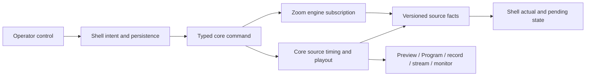

# Operator timing and source controls

Issues: [#627](https://github.com/iamfatness/CoreVideoPro/issues/627),
[#592](https://github.com/iamfatness/CoreVideoPro/issues/592),
[#681](https://github.com/iamfatness/CoreVideoPro/issues/681),
[#456](https://github.com/iamfatness/CoreVideoPro/issues/456), and
[#668](https://github.com/iamfatness/CoreVideoPro/issues/668).
Execution: [operator-source-controls-plan.md](operator-source-controls-plan.md).
This is a behavior and ownership contract. [BACKLOG.md](BACKLOG.md) remains the
only work order and the issues remain the status record.

## Product goal and boundaries

An operator should be able to cue a person or clip, know exactly what will be
heard and seen, and Take without a surprise. 1080p60 per-frame delivery and
low latency remain acceptance requirements. These controls change an individual
source or a future session; none may hide a pipeline defect with a global delay,
reduce quality by default, or trigger Zoom subscriptions on a Preview cue.

The WinUI shell owns operator intent, settings, text inputs, and read-only
projection. The Zoom engine owns Meeting SDK subscription mechanics and facts.
The C++ core owns timed video, PCM, playout, compositing, routing, and output.
Commands and facts carry meeting/source generation where relevant; stale
responses cannot overwrite a newer operator choice. The existing versioned
source projection is the repair path. No new shell media path, thumbnail
encoder, or fourth snapshot is needed.



| Fact or decision | Owner | Operator surface |
|---|---|---|
| Desired Zoom camera ceiling | Settings, persisted by shell; applied by Zoom subscription policy | Sources preference and pending/current label |
| Actual Zoom format and frame age | Zoom/core fact, never inferred from ceiling | Existing Sources Format/Status |
| Zoom identity, host/me and exclusion | Zoom facts plus explicit operator exclusion; core routing policy decides | Active Speaker source option |
| Manual guest lip-sync trim | Operator intent, applied by core to that source's timed media | Guest audio control with applied value |
| Lower-third text content and version | Shell resolves full metadata; core atomically displays it | Overlay editor and rendered Preview/Program |
| Clip In/Out | Per-asset stored intent; core transport enforces | Selected clip properties |

## #627 — manual Zoom guest lip-sync trim

This is an operator adjustment for a particular guest, not an attempt to
correct Zoom's changing network delivery automatically. Default is zero. A
single pipeline skew measured in a Zoom mailbox clap must not become every
guest's setting. Capture-device `setAudioSyncOffset` remains separate.

Use a signed millisecond control with explicit meaning: **positive delays the
guest's audio**; **negative delays that guest's video** to obtain the same
relative correction when audio is late. The UI must spell out which medium is
delayed and the resulting added latency. Do not claim to advance audio that
has already played. Propose a bounded initial range of -200 to +200 ms, in
10 ms steps, with direct numeric entry and Reset to 0; the first PR must
justify this range with measured queue/latency behavior before shipping.

Apply on the guest's individual core source before destination fan-out so
Preview, Program, recording, stream, and applicable ISO remain consistent.
Monitor must follow the same guest PCM; its endpoint latency is separately
measured by #652. No destination-wide A/V offset. Keep the delay line bounded,
flush it on source generation/meeting epoch changes, and do not carry an SDK
numeric user id into a later meeting. The control is session-scoped initially;
future persistence requires a stable person identity and explicit opt-in.

When the app consumes only an inseparable Zoom meeting mix, disable this
control with an explanation. In per-guest ISO mode, mute and mixer mute remain
separate; changing the trim cannot silently unmute or subscribe. The visible
value distinguishes requested from applied and is cleared when the source
ends. A timed clap with two guests must show only the chosen guest shifted;
0 ms must match current behavior. Measure all enabled destinations and lost
samples/underruns before accepting either sign. Do not automate drift chasing.

## #592 — lower-third secondary line stability

Trace one frame sequence from participant metadata, through shell text/key
resolution, to native raster publication and Program/recorded output. The
current `RoleLabel` yields `Guest`; a momentary `g` is not proof that the
metadata actually changed. First identify which stage produced the fragment.

Resolve the *whole* secondary string and its source identity once per update.
Publish a complete immutable text version to the renderer; never expose an
intermediate character buffer or partial raster. If source and resolved text
are unchanged, neither raster revision nor enter animation restarts. A real
edit replaces the full line once. Define one casing policy for role fallback
(`Guest`) across Preview, Program, recording and stream. A source switch may
animate under the existing overlay rule; a metadata refresh of the same
source must not play a new entrance. Preserve explicit operator text from
#593 rather than normalizing its case.

Acceptance requires a deterministic rapid metadata/fact test that would fail
if atomic text publication or the stable-key guard were removed, plus a
captured installed run showing no fragment during roster churn and a real
secondary-line edit. Fix only the stage shown by the trace.

## #681 — preferred maximum Zoom camera resolution

Offer one global camera ceiling: 360p, 720p, or 1080p; default **1080p** on
new and existing installs. This is a *request maximum*, not a promised
negotiated frame. The Sources row continues to show actual WxH@fps and frame
age independently, with the requested cap dimmed when different. Preserve
screen-share policy and the 1080p high-resolution budget; 60 fps is a separate
delivery goal, not a fourth resolution option.

The selected ceiling is uniform across camera purposes for the entire Zoom
session. Saving a change during a meeting marks it **pending for next Zoom
join**; current subscriptions and Preview cues retain the applied ceiling.
At the next join, the Zoom engine applies it through its subscription policy
before camera subscriptions are built. Do not re-key live renderers on cue.
If Zoom negotiates lower, show the actual lower format without rewriting the
preference. A preference change must not add subscriptions or hide a stalled
feed. Engine off and meeting epoch transitions clear old actual numbers.

Acceptance: settings migration/default, restart persistence, 360/720/1080
policy and budget tests, no subscription churn on Preview/Take, and an
installed meeting showing current versus pending and actual versus requested.

## #456 — per-asset clip In/Out

The selected media asset gets a compact **Clip range** group below its
existing preview and transport controls. This is the UI design for owner
review before code, as required by #456. See the
[visual mockup](mockups/media-clip-range.png):

```text
Selected clip                         duration 00:02:14.080
Clip range
In   [00:00:04.200]  [Set from playhead]       [Reset]
Out  [00:01:38.000]  [Set from playhead]       [Reset]
Effective duration 00:01:33.800     Applied on next cue
```

Time input uses hours:minutes:seconds.milliseconds and keyboard entry. Set
from playhead uses the existing transport position fact; if unavailable, it
is disabled with a reason. Reset In means 0; Reset Out means known duration.
The group shows validation inline and never silently clamps the other point.
Valid range is `0 <= In < Out <= known duration`, with interval `[In, Out)`.
If duration is unknown, Out cannot be set until probing succeeds; the asset
continues to play untrimmed. Show time and effective duration for audio-only
assets too. No additional shell decoder or PCM/video ownership.

Trim belongs to an asset, not a scene copy, and persists with the media
library. Detect a replaced file and invalidate or revalidate its range
against the new duration; never reuse a stale Out silently. Editing a clip
already on Program stages a new trim version for the **next cue** and labels
it pending; the playing Program transport is untouched. A cue starts at In.
One-shot reaches Out and completes; loop returns to In at Out. Seek cannot
escape the range. Video and audio obey the same boundaries and remain synced.
The effective range is shared by Preview, Program, recording and stream once
the cued version is Taken. Cold Take behavior from #449 remains a separate
gate. The Media Foundation and FFmpeg fallback paths must implement identical
edge semantics, including audio-only and end-of-file cases.

Acceptance: UI validation/persistence, frame/PCM boundary tests at both
ends, loop and one-shot, pause/seek, on-air edit staging, re-opened asset,
ProRes fallback, and installed Preview → Take → record/stream. A test must
fail if only the UI values change and decode still starts at zero.

## #668 — host-selectable Active Speaker

The earlier [speaker-floor director spec](speaker-floor-director-spec.md)
made host exclusion unconditional. Owner direction on 2026-09-28 changes
**Active Speaker sources**: provide two explicit source choices:

| Source choice | Host eligible? | Existing configuration |
|---|---:|---|
| Active Speaker — guests only | No, while a guest has a content frame | Retains existing behavior |
| Active Speaker — include host | Yes, if host has a content frame | New opt-in choice |

The OBS plugin provides precedent for **per-source speaker exclusions**
(`src/zoom-source.cpp`, `speaker_exclude_participant_1/2` in the local
CoreVideoOBS repository). This choice belongs to each directed source, not a
global meeting switch. If both variants are present, each needs independent
selection/hold state keyed to its policy and meeting epoch. An explicit
director-exclude still wins in both modes; operator Host designation alone
does not become an exclusion in the include-host variant. A local UVC host
alias and the host Zoom tile resolve to one person. The render-plan builder
continues to refuse two visible slots for the same person.

Magic Scene's talk ledger, guest-only interview qualification, screen-share
priority, and Set & Forget holds retain their existing rules. This change
does not silently make a host a guest talker slot. With a guest content frame,
guest-only follow holds that guest even if host speaks; include-host follow
may select host under the same debounce and frame-validity rules. Without a
content frame, neither variant binds a blank host. Source selection affects
Preview immediately; Program changes only by the existing Take or Set &
Forget route. Existing saved scenes migrate to guest-only.

Acceptance: native routing tests for both variants at once, host/guest
speaker transitions, explicit exclude precedence, host UVC alias uniqueness,
epoch reset, and installed two-source Preview/Program proof. A test must go
red if the policy collapses back to one global host toggle or if the unique
person refusal is removed.

## Cross-feature acceptance

Run an installed scenario with host UVC plus Zoom host and two guests, one
trimmed clip, a lower third, and recording/streaming enabled. Verify fact
updates without clicking rows, source choices without unexpected Take, and
actual versus pending values. Preserve zero audio lost samples/monitor
underruns and report scheduled Program/output frame misses separately from
average fps. Hardware tests that self-skip are `MISSING_EVIDENCE`.
