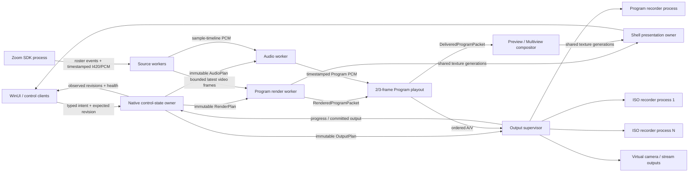

# CoreVideo Pro target real-time architecture

Status: proposed architecture decision after the 2026-09-09 live soak.

Execution roadmap: `PRODUCTION-ARCHITECTURE-EXECUTION-PLAN.md`.

This document supersedes a fix-by-symptom reading of `FIRST-SOAK-REMEDIATION-PLAN.md`. The earlier plan identified the correct work areas, but the implementation must be driven by the ownership and timing model below.

## Decision

Retain the current product process boundaries, but substantially refactor ownership inside the native media system and add supervised recording processes.

- WinUI remains the operator control surface. It owns drafts, interaction, and presentation surfaces; it never owns media policy or real-time media work.
- The native core contains one serialized control-state owner. It owns the authoritative live roster, source instances, applied scene/routing state, output intent, operation ordering, and revisions.
- Zoom remains isolated in its SDK process and publishes timestamped bounded media plus roster/source events.
- Video rendering, audio mixing, Program playout, monitor composition, and output delivery become independent workers consuming immutable plans. None takes the global control-state lock in steady state.
- Program recording and ISO recording move behind separately supervised process boundaries. A blocked writer can be terminated without blocking Program, rendering, audio, control, or another ISO.
- The virtual-camera process boundary remains.

A separate renderer process is not the first move. It adds GPU-resource handoff and restart complexity without removing physical GPU contention. Add it later only if driver calls can still hang indefinitely after thread/context ownership is corrected, or independent renderer restart becomes a product requirement.

## Target data model

### Authoritative live state

The native control-state owner publishes a monotonically revisioned immutable `ShowState` containing:

- `PersonId`: durable editorial identity.
- `SourceInstanceId`: one concrete Zoom/capture/media source instance.
- `SourceGeneration`: changes whenever a source disconnects, reconnects, changes device, or is replaced.
- Source availability, media format, frame/audio freshness, and subscription state.
- Show Input membership and ISO selection.
- Scene definitions, route intent, missing/blank policy, overlays, and automation state.
- Program revision, Preview revision, and output configuration revision.

Names and transient Zoom participant IDs are attributes, not identity. A route resolves to a specific identity/generation or to an explicit missing/ambiguous/blank state. It must never silently fall through to a different participant because a collection refreshed.

WinUI, OHG, Companion, and automation submit typed intent with `operationId`, `expectedRevision`, and idempotency semantics. They may maintain local editing drafts, but only native acknowledged/applied state is live truth.

### Atomic Take

Take is a native edge operation:

1. Validate an exact Preview revision.
2. Atomically promote its scene, routes, media playback generation, overlays, and transition definition.
3. Return `acceptedRevision` and operation identity.
4. Later observations report `renderedRevision`, `deliveredRevision`, and `presentedRevision`.

Command acceptance never claims that pixels appeared. Duplicate operation IDs are idempotent; stale revisions fail explicitly.

## Target execution model

### Control-state owner

- Serializes commands and edge operations.
- Validates and publishes immutable plans through atomic revisioned pointers/mailboxes.
- Never calls a GPU driver, SDK, filesystem, encoder, network sender, logging sink, or UI dispatcher.
- Publishes requested, accepted, applied, producing, and committed states separately.

This replaces the current pattern where `JsonRpcServer` holds `coreMutex` across `renderDisplayTick` and a 200+ ms driver stall becomes a system-wide state stall.

### Source workers

- Normalize Zoom, capture, browser, and media sources into immutable frame/audio references.
- Use bounded per-source mailboxes and generation-aware timestamps.
- Video uses latest-eligible-frame semantics with explicit stale rejection.
- Audio uses a sample timeline. Discontinuity is counted and surfaced; it is never hidden by a clock reset.
- Source retirement releases subscriptions, SHM mappings, textures, and caches by generation.

### Program render worker

- Sole owner of its D3D immediate context and render resources.
- Captures one immutable `RenderPlan` and eligible `SourceFrameSet` per rational video slot.
- Produces `RenderedProgramPacket` with slot, configuration revision, source generations, render evidence, GPU resource lease, and completion state.
- Performs no control-state locking or synchronous UI/output work.
- Uses bounded resource rings; a resource is reused only after completion evidence.

### Program playout

- Owns the selected two- or three-frame latency on one monotonic rational timeline.
- Pairs delayed Program video slots with the matching Program audio sample range.
- Publishes ordered `DeliveredProgramPacket`s with exact delivery sequence and PTS.
- Never reanchors to disguise missed work. Expired or missing slots are explicit failures.
- Separates producer failure, GPU-preparation failure, playout expiry, output rejection, and display-consumption diagnostics.

The buffer absorbs bounded jitter. It is not a throughput fix and must not grow to mask sustained overload.

### Monitor compositor and shell presentation

- Preview/Multiview composition is independent of Program production. When monitor work misses its budget, it retains its last complete monitor frame and reports the miss; it cannot delay Program.
- The Multiview Program cell consumes the delivered Program packet. It must not rebuild Program from current desired state.
- One shell presentation service owns its D3D context, ingest cache, copy submission, swap chains, and teardown generations.
- UI callbacks attach/detach panels and post bounded presentation requests. They do not execute per-host GPU copies or blocking Present calls directly.
- Frame-latency admission occurs before back-buffer copy. A failed/non-ready Present does not repeat a copy for the same frame generation.

### Audio worker and show clock

Audio and video stay on separate workers but share an explicit show timeline:

- Source timestamps map to a session monotonic clock.
- Video uses rational output slots, including exact 60 or 60000/1001 profiles.
- Audio uses integer sample positions at the configured sample rate.
- The selected Program delay maps to both video slots and Program audio samples.
- Capture-clock drift correction is distinct from lost/discarded samples.

The audio worker consumes immutable routing/DSP plans and publishes bounded meter/health results. It never acquires the control-state lock, waits for rendering, or performs diagnostic I/O. Any FIFO shedding or pacer reanchor is a production health failure.

### Output and recording supervisor

Every destination has an independent bounded queue, worker/process, health record, and overload policy. A destination cannot block playout or another destination.

Program recording has reserved priority and capacity. Each ISO writer has its own failure boundary. Encoder placement is frozen for a recording generation and based on measured adapter/codec/resolution/fps capacity; hardware-session creation alone is not proof of sustainable capacity.

Each Media Foundation writer process initializes COM/MF, creates writers, writes, finalizes, and tears down on owned execution contexts. A separate responsive supervisor can terminate a stuck writer.

Recording state is transactional:

`requested -> preparing -> producing -> stopping -> finalizing -> completed`

Any state may become `failed`; health may be degraded while still producing. `producing` requires fresh committed progress. `completed` requires closed and validated artifacts. Stop returns an operation ID and remains pending until every required destination has a terminal result.

Track accepted, encoded, muxed, and durably committed ranges independently. A journal and atomic manifest record committed segments. Recovery preserves partial files, starts a new generation/segment, and reports missing intervals without claiming continuity.

## Backpressure rules

| Boundary | Capacity policy | Overload result |
| --- | --- | --- |
| Source video -> renderer | Small timestamp-aware latest-frame mailbox | Reject stale frames and count source loss |
| Source audio -> mixer | Time-bounded sample ring derived from latency budget | Report discontinuity/fail health; never silently reanchor |
| Renderer -> playout | Fixed two/three-frame slots | Missed slot is a Program failure |
| Playout -> monitor | Latest complete delivered frame | Monitor may skip; Program continues |
| Playout -> each output | Independent bounded ordered queue | That destination degrades/fails; siblings continue |
| Control state updates | Coalesce replaceable state by revision | Edge operations remain ordered and idempotent |

No queue is enlarged to solve inadequate throughput. Admission rejects unsupported source/output configurations before the show.

## Health and observability contract

Generation-scoped counters are always available at low cost and do not depend on verbose logging:

- Captured, selected, rendered, GPU-completed, scheduled, exported, presented, accepted by destination, muxed, and committed identities.
- Current/maximum queue depths and oldest-item age.
- Per-stage deadline misses and current operation age.
- Audio expected/completed sample ranges, discontinuities, shed samples, and drift corrections.
- Live/peak resource counts and bytes for source caches, D3D textures, shared handles, SHM mappings, Program slots, subscriptions, and encoder queues.
- Desired, accepted, applied, producing, finalizing, completed, failed, and interrupted revisions/generations.

Detailed stage traces remain operator-enabled in Health and bounded. Health must be derived from fresh progress and completion evidence, not a requested Boolean or a first-frame latch.

## Migration plan

### Foundation A - Contracts and truthful release gate

1. Define generated schemas for `ShowState`, source identity/generation, plan revisions, Take operation, media packet identity, destination lifecycle, and completion evidence.
2. Harden the soak harness to verify actual configuration, stable process generations, native convergence, visible frame progression, per-slot deadlines, audio continuity, and finalized decoded media.
3. Add low-cost counters needed to attribute the current stalls and writer blockage.

No live behavior switches in this stage.

### Foundation B - Authoritative state in shadow mode

1. Build the native serialized state owner and immutable plan generators alongside current logic.
2. Feed the same roster, scene, routing, audio, and output intent to both paths.
3. Compare revisions and resolved identities without producing duplicate external side effects.
4. Resolve every divergence, especially reconnect, source replacement, missing participant, explicit blank, ISO selection, and scene draft/Take cases.

### Execution C - Atomic Take and worker plan adoption

1. Move Take and applied Program/Preview ownership into the native state owner.
2. Migrate renderer input to immutable `RenderPlan` and `SourceFrameSet`.
3. Remove GPU/driver calls from `coreMutex`; retire the global lock from steady-state rendering.
4. Move Multiview/Preview to the independent monitor compositor.
5. Introduce the shell presentation owner and remove per-host UI-thread Present work.

### Execution D - Timeline and audio isolation

1. Establish the shared show timeline and packet/sample identities.
2. Make Program playout the sole owner of two/three-frame delay and delivered Program identity.
3. Migrate audio to immutable plans with no control lock crossings.
4. Eliminate silent PCM shedding/reanchor behavior from acceptable production operation.

### Execution E - Supervised output subsystem

1. Correct COM/MF ownership and lifecycle truth immediately behind the new destination contract.
2. Move Program recording into its supervised process with reserved capacity.
3. Move ISOs into independent supervised writers and add real encoder-capacity admission.
4. Add transactional Stop/finalization, artifact validation, segment journal, and recovery.
5. Apply the same independent-destination contract to streaming and other outputs.

Foundations A/B can run in parallel. Execution C/D and E can proceed in parallel after their contracts stabilize, then integrate through `DeliveredProgramPacket`.

## Required architecture tests

- Block the compositor for seconds while control, audio, and health remain responsive.
- Block one shell Present while UI control and native Program continue.
- Block or crash one ISO writer while Program and other ISOs continue and Stop reaches a terminal result.
- Exhaust encoder capacity and reject the configuration before recording starts.
- Reconnect or replace a participant and prove routes bind only to the intended durable identity/generation.
- Apply stale/duplicate Take and output commands and verify revision/idempotency behavior.
- Disconnect sources and verify bounded resource retirement.
- Simulate disk full, slow storage, device loss, process death, and power interruption.
- Decode Program/ISOs and verify duration, packet coverage, timestamp continuity, content identity, and A/V alignment.

## Production acceptance

- 1920x1080 at the configured 60 fps for the full hour with zero Program slot misses, underruns, overflows, frozen visible frames, or hidden clock reanchors.
- Both selectable buffer depths pass independently.
- Program, Preview, Multiview, audio, and all outputs report the same applied revisions and timeline identities appropriate to their roles.
- Zero permanent PCM loss.
- Program and every admitted ISO finalize without application exit and decode for the full requested duration.
- A failed optional destination cannot affect Program, control, audio, or another destination.
- Memory reaches a documented plateau and releases generation-owned resources after source/output teardown.
- The exact packaged installer passes the RTX 4090 and RTX A2000 full-show matrices.

## Rejected shortcuts

- Increasing the Program buffer beyond the chosen latency.
- Changing only `Present(1)` to `Present(0)` without measured completion/admission behavior.
- Moving shared D3D immediate-context calls to arbitrary tasks.
- Adding retries/timeouts while keeping GPU or writer calls under shared ownership.
- Treating command acknowledgement, nonzero bytes, or a first encoded frame as sustained output health.
- Disabling ISOs or silently falling back to CPU encoding to make a test pass.
- Enlarging media queues to hide insufficient throughput.
