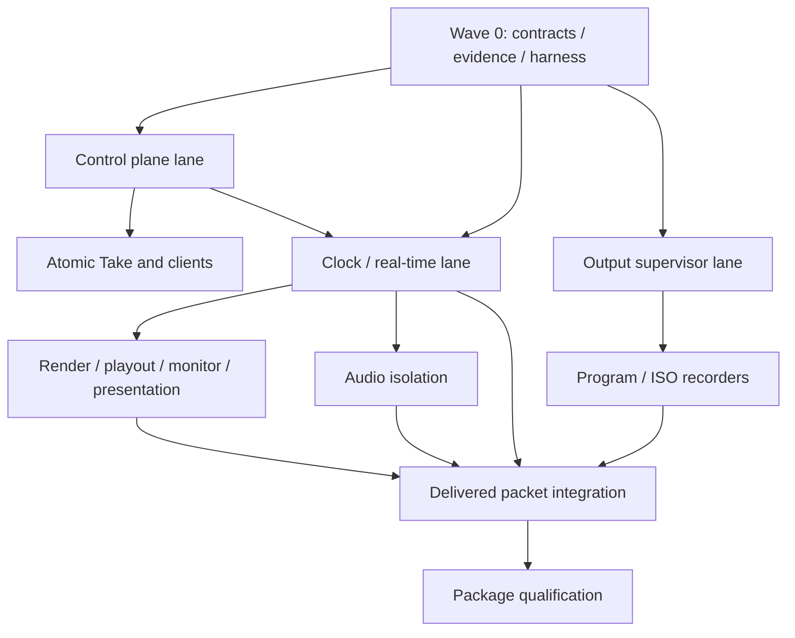

# CoreVideo Pro production architecture execution plan

Status: approved; execution in progress

Controlling architecture: `production-realtime-architecture.md`

## Execution record

- Wave 0 contracts, evidence, and qualification fail-closed foundation: `85dd7d8`.
- Authoritative ShowState and SourceRegistry foundation: `257ff26`.
- Deterministic plan preparation and Take coordinator: `9bfd2d9`.
- Exact source/command adapters, camera-off stale-frame fencing, and shadow design:
  `678c024`.
- Bounded disabled authority shadow, truthful legacy checkpoint projection,
  typed Zoom source observations, exact provider source instances/generations,
  non-churning eligibility identity, revocable preparation certificates, and
  the rational ShowClock: `f6089d3`. These remain pre-cutover:
  the legacy MediaCore is still production authority until truthful runtime
  checkpoints, client adoption, and parity gates pass.
- Semantic legacy capture ledger, lossless Zoom observation bridge with explicit
  unknown evidence, source-format plan invalidation, and immutable Windows Take
  request contract: `f5b9f53`. This provides cutover inputs without enabling a
  second side-effect path.
- Strict native Take JSON, exact source identity catalogs on full/capture/spine
  snapshots, process/epoch/sequence admission, restart invalidation, and ordered
  bounded shell publication: `0c0c90d`. Stale or malformed authority now fails
  closed before it can restore roster, routing, or meeting UI state.

## Outcome

Deliver a production media system that:

- Sustains the admitted 1920x1080/60 workload for a full show with either a two- or three-frame Program buffer.
- Keeps control, video, audio, monitoring, and each output destination in independent failure domains.
- Uses one authoritative roster/routing/scene/output state and one explicit A/V timeline.
- Reports requested, applied, rendered, delivered, presented, muxed, committed, and completed state truthfully.
- Finalizes full-duration Program and admitted ISO recordings without application exit.
- Rejects unsupported workloads before a show instead of silently lowering quality or accumulating latency.

This is an architecture migration. Passing unit tests, improving average fps, increasing a queue, or making the UI appear responsive does not complete it.

## Non-negotiable engineering rules

1. **One authority per decision.** The native control-state owner decides live source identity, routing, applied scenes, Take, output intent, and revisions. Clients own editing intent and presentation only.
2. **One owner per mutable execution resource.** Every D3D immediate context, swap chain, encoder, SDK object, queue, shared-memory mapping, and file writer has one execution owner and an explicit retirement generation.
3. **No real-time worker waits for control or UI.** Render and audio workers consume immutable plans. They never perform SDK, file, network, UI-dispatch, or diagnostic I/O.
4. **No hidden time repair.** Missing video slots, audio samples, writer ranges, and clock discontinuities are recorded as failures. Reanchoring or padding cannot turn loss into success.
5. **Bounded backpressure.** Every boundary has a capacity derived from its latency budget and a declared overload outcome. Queues cannot grow to hide inadequate throughput.
6. **Program has reserved priority.** Optional monitoring, streams, and ISOs cannot delay Program production, Program audio, Program playout, or Program recording.
7. **Health requires fresh evidence.** A request acknowledgement, first frame, or nonzero file does not establish ongoing health. Terminal success requires completed work and artifact validation.
8. **No duplicate side effects during migration.** Shadow paths may compare decisions and observations; they may not render twice, start duplicate recordings, publish a second stream, or replay Take.
9. **Cutovers occur at generation boundaries.** Active implementation, plan revision, clock generation, and output generation are recorded. A live recording never changes clock or writer implementation in place.
10. **Release evidence comes from the packaged binary.** Development builds and synthetic tests are prerequisites, not substitutes for hardware qualification.

## Program structure

Relative size: S is a focused change, M is a subsystem change, and L is a substantial ownership migration that must remain one coherent review.

### Wave 0 - Freeze contracts and establish truthful evidence

These PRs can run in parallel but must merge before behavioral cutover work is accepted.

| PR | Deliverable | Size | Exit gate |
| --- | --- | --- | --- |
| 01 | Generated identity and revision contracts: `PersonId`, `SourceInstanceId`, source generation, `ShowRevision`, Preview/Program revision, operation ID, clock generation, video slot, audio sample range, destination generation | M | C++, C#, TypeScript, and Swift fixtures accept compatible fields, reject invalid identity/generation combinations, and preserve unknown-field compatibility |
| 02 | Generated media/output evidence contracts: rendered/delivered/monitor packet identity, resource lease descriptor, destination lifecycle/progress, artifact result | M | Accepted, applied, rendered, delivered, presented, muxed, and committed observations cannot be confused in tests or UI projection |
| 03 | Always-on bounded telemetry: independent expected-slot clock, stage deadlines, queue depth/age, current-operation age, cumulative audio loss, process/resource generations, live/peak allocation ownership | M | Counters work with verbose logging off, expose resets/gaps, flush final partial intervals, and cannot pass when the observed worker stops updating |
| 04 | Production qualification harness replacing acknowledgement-only success | M | Injected frozen worker, process replacement, stale revision, missing evidence, partial recording, clock reset, audio shedding, and zero-byte file all fail deterministically; cleanup always runs |

Deliverable gate G0: the current build is rerun for five minutes and the harness fails for the known render, audio, and recording defects with attributed evidence.

### Wave 1 - Establish one authoritative control plane

| PR | Deliverable | Size | Dependencies | Exit gate |
| --- | --- | --- | --- | --- |
| 05 | Native source registry with durable person identity, transient source instance/generation, availability, subscription, format, and freshness | M | 01 | Deterministic reconnect, duplicate-name, ambiguity, participant replacement, device replacement, and departure behavior; old generations cannot become current |
| 06 | Revisioned `ShowState` owner for Show Inputs, ISO selection, scene/routing state, overlays, audio/output intent, Program and Preview | L | 01, 05 | Commands serialize without creating a shared god object; state mutation publishes immutable records only and performs no SDK/GPU/I/O work |
| 07 | Immutable Render/Audio/Output plan generators in shadow mode | M | 02, 06 | All supported golden show scenarios match current intentional behavior; missing/blank/ambiguous routes remain explicit; every divergence is reviewed and resolved |
| 08 | Resource preparation transaction | M | 06, 07 | New plans become applied only after required source subscriptions, GPU resources, and output reservations are ready; preparation failure leaves prior applied revision intact |
| 09 | Atomic native Take with expected Preview revision, operation ID, idempotency, transition definition, media generation, and observed render/delivery revisions | L | 07, 08 | Normal and same-scene Take, media cue, stale revision, duplicate request, lost acknowledgement, and transition identity cases pass |
| 10 | Windows client adopts authoritative state and native Take; shell optimistic booleans become requested-state indicators only | M | 09 | UI, HTTP API, and native observations agree; pending/unknown operations reconcile by ID; no collection refresh can substitute a different source |
| 11 | macOS, OHG, and Companion adopt the same capability/versioned contracts in separate PRs | M each | 09 | Shared golden scenarios pass per client; unsupported capabilities fail explicitly |

Deliverable gate G1: one native dataset answers who is present, which source generation is usable, who is in the show, who gets an ISO, what Preview contains, and what Program actually rendered. Every client is a projection or intent producer.

### Wave 2 - Build the deterministic real-time execution substrate

Clock and source work starts after PR 01. Render, presentation, and audio lanes can proceed in parallel after their interfaces stabilize.

| PR | Deliverable | Size | Dependencies | Exit gate |
| --- | --- | --- | --- | --- |
| 12 | `ShowClock`: monotonic session epoch, rational video slots, integer audio sample timeline, capture timestamp mappings, generation/discontinuity rules | M | 01, 02 | Exact 60 and fractional-rate timelines, two/three-frame offsets, long-duration drift, discontinuity, restart, and epoch tests pass |
| 13 | Source workers expose bounded generation-aware immutable frame/audio leases | L | 05, 12 | Slow decode, format change, disconnect during copy, stale frame, source churn, and resource retirement stay bounded and preserve identity |
| 14 | `ProgramRenderWorker`, sole owner of Program D3D context/resources and animation state, consuming immutable plans and source leases | L | 07, 08, 12, 13 | A fake compositor blocked for seconds cannot delay command/state/health; actual rendered revision and source generations remain correct; no GPU call occurs under `coreMutex` |
| 15 | `IProgramPlayout` adapts/replaces the current buffer behind fixed slot scheduling and owning packet leases | L | 12, 14 | Both buffer depths pass exact deadline tests; late GPU completion/expired slots fail explicitly; teardown is asynchronous and generation-safe |
| 16 | Independent Monitor compositor for Preview and Multiview | L | 13, 15 | A blocked monitor cannot delay Program; Multiview's Program cell matches the exact delivered packet; Preview may advance independently with explicit revision evidence |
| 17 | Shell `PresentationService` owns shared context, ingest broker, swap chains, frame-latency admission, and teardown generations | L | 02; compatible with 14-16 protocol | A blocked Present cannot block UI control or native Program; multi-host fairness, resize/unload, stale handle, device loss, and non-ready Present tests pass on real D3D |
| 18 | Audio worker consumes immutable plans/sample ranges and publishes results without control-lock crossings | L | 07, 12, 13 | Injected render/control stalls do not interrupt audio; expected/completed sample ranges match; zero permanent PCM loss or hidden pacer reanchor in admitted workload |

Implementation requirements:

- Rendering never holds `coreMutex`; control state is captured through atomic immutable snapshots.
- Each D3D immediate context has one owner. Work is not moved to arbitrary tasks.
- GPU resources use bounded rings and explicit completion evidence before reuse.
- Preview/Multiview may coalesce monitor requests; Program playout and output packets remain ordered.
- The Multiview Program cell consumes delivered Program rather than reconstructing desired Program.
- Program delay applies coherently to video slots and Program audio samples.

Deliverable gate G2: a ten-minute real-meeting run sustains the admitted 1080p60 Program workload with zero Program slot loss and zero permanent audio loss while monitor rendering and shell presentation are fault-injected independently.

### Wave 3 - Replace output and recording with supervised destinations

This lane starts after PR 02 using synthetic media packets, then integrates with real delivered packets from Wave 2.

| PR | Deliverable | Size | Dependencies | Exit gate |
| --- | --- | --- | --- | --- |
| 19 | Native output supervisor: per-destination process generation, operation/lifecycle state, independent bounded queues, control/health IPC, deterministic fault host | M | 02, 03 | Hang, crash, malformed reply, IPC disconnect, stale completion, and restart cannot block supervisor/control or affect siblings |
| 20 | Bounded cross-process media transport with resource leases and acknowledgements; synthetic consumer first | L | 12, 19 | A stalled consumer cannot pin renderer/playout resources, grow memory, or block another consumer; stale generations are rejected at ingress and completion |
| 21 | Recorder host with writer-owned COM/Media Foundation initialization, execution, finalization, and teardown | M | 19 | Real MF recording through the host proves same-owner initialization/use/cleanup; blocked calls leave health/control channel responsive |
| 22 | Truthful destination lifecycle and API projection on the new host | M | 21 | `requested -> preparing -> producing -> stopping -> finalizing -> completed/failed/interrupted`; fresh progress is required for producing; Stop acknowledgement never claims completion |
| 23 | Dedicated Program recorder process with reserved admission/resources | L | 20-22 | Repeated full-resolution Start/Stop succeeds; host death or blocked write/finalize cannot affect render/audio/control; Program artifact validates |
| 24 | Independent ISO recorder processes bound to exact source generations | L | 05, 20-23 | One stalled/crashed ISO cannot affect Program or siblings; missing/departed sources produce explicit per-destination outcomes |
| 25 | Encoder and storage admission manager | L | 23, 24 | Capacity considers adapter, driver, codec, resolution, fps, concurrent sessions, GPU transfer, CPU, memory, and storage throughput; unsupported sets reject before Start without silent quality changes |
| 26 | Transactional Stop, independent finalization deadlines, packet/range reconciliation, and artifact validation | M | 22-24 | Every writer terminates as completed/failed/interrupted; completed files decode and cover committed ranges; partial success is reported per destination |
| 27 | Segmented journal, atomic manifest, crash/power-loss recovery inspection | L | 26 | Fault injection at every commit phase preserves committed segments, reports missing intervals, and never claims invented continuity |
| 28 | Apply independent destination ownership to streaming and virtual-camera delivery | M per adapter | 15, 19, 20 | One destination's overload/failure cannot affect Program or another destination; each exposes actual consumption evidence |

Media transport design gate before PR 20 implementation:

- Prototype cross-process D3D/shared-resource delivery and a bounded shared NV12/PCM alternative.
- Measure copy, import, completion, CPU, GPU, and memory costs under Program plus seven ISOs.
- Select the transport that keeps renderer/playout resource ownership bounded and avoids render-thread driver waits.
- Record the decision in an ADR. Do not lock the architecture to the current CPU readback path without evidence.

Deliverable gate G3: Program plus the admitted ISO set records the full requested duration, stops and validates without closing the app, while individual writer hangs and storage faults remain isolated.

### Wave 4 - Integrate, remove legacy ownership, and qualify the product

| PR | Deliverable | Size | Dependencies | Exit gate |
| --- | --- | --- | --- | --- |
| 29 | Connect output supervisor to authoritative `DeliveredProgramPacket` and aligned PCM; remove transitional feed | L | G2, G3 | Both buffer depths preserve exact video slot and audio range identity through every admitted destination |
| 30 | Startup-selected new execution path and capability negotiation; legacy adapters retained only for bounded rollback period | M | 10, 14-29 | Active implementation/revisions/generations appear in Health; rollback requires a safe stopped boundary and cannot replay Take or output operations |
| 31 | Remove legacy render/state/output ownership after parity evidence and usage audit | M | 30 | No duplicate policy path remains; generated contracts and architecture ownership docs match implementation |
| 32 | Exact-package qualification, resource budgets, support bundle, and release automation | M plus validation | all | G4 production gate below passes and exact hashes/provenance are retained |

## Parallel delivery and integration ownership

- One integration owner controls changes to central `MediaCore` publication/cutover points.
- Lanes add interfaces/adapters around those seams rather than concurrently rewriting the same class.
- Each PR states its dependency, supported compatibility behavior, failure semantics, rollback boundary, evidence produced, and legacy code scheduled for deletion.
- Large PRs are split by ownership boundary or platform adapter, never by leaving half an invariant active.

## Cutover strategy

1. Shadow only deterministic state/plan generation. Compare revisions and decisions; produce no duplicate external media.
2. Select legacy or new execution at process startup and publish that selection in Health/support evidence.
3. Cut over one ownership boundary at a quiescent generation boundary.
4. Reconcile any unknown operation by operation ID before retrying.
5. Roll back through a clean restart with a new execution generation. Preserve recording segments and mark continuity interrupted.
6. Do not change implementation or clock generation during an active recording/output session.
7. Remove each legacy path after its semantic, fault, performance, and package gates pass. Feature flags are temporary migration tools, not permanent alternate architectures.

## Validation system

### Contract and deterministic tests

- Cross-language schema/version compatibility.
- Identity ambiguity, reconnect, replacement, missing source, explicit blank.
- Stale/duplicate/lost-ack operations and idempotent reconciliation.
- Rational video slot and integer audio-sample timelines over long durations.
- Resource lease/generation rejection and retirement.

### Real-adapter integration tests

- D3D device loss, Present stall, blocked compositor, resize/unload, multiple hosts.
- Slow SDK callback, source format change, source departure and subscription churn.
- Media Foundation capacity exhaustion, blocked `WriteSample`, blocked Finalize, writer crash.
- Disk full, slow storage, IPC corruption/disconnect, output process restart.
- WASAPI device loss, clock drift, routing change and plugin/DSP delay.

### Artifact tests

- ffprobe stream/codec/duration/timestamp validation.
- Full decode, packet coverage, frame identity, varied image-content evidence.
- Program/ISO shared epoch and per-source identity.
- Audio sample coverage, discontinuity reporting, and content-based A/V alignment.
- Segment manifest/journal recovery after controlled and abrupt termination.

### Memory and resource tests

- Warm-up followed by steady-state measurement; do not classify warm-up slope as a leak.
- Source join/leave/reconnect, scene churn, repeated Start/Stop, device loss and recovery.
- Assert live/peak counts and bytes for textures, slots, handles, SHM, caches, SDK subscriptions, queues and writer processes.
- Verify generation-owned resources retire within declared deadlines after teardown.

## Production gate G4

Run against the exact installer candidate in this order:

1. Five-minute diagnostic matrix: Program only; Program plus Multiview; presentation attached/detached for attribution; recording off/on; Program-only, one ISO, and full admitted ISO set.
2. Thirty-minute live rehearsal with participant joins/leaves, source replacement, camera-off/on, screen share, Tiles/Panel/custom scenes, every transition, lower thirds, Magic Scene, both buffer depths, recording, and enabled outputs.
3. Sixty-minute RTX 4090 run at 1080p60 for each supported buffer depth.
4. Sixty-minute 11th-generation i7/RTX A2000 run for each advertised workload/buffer depth.
5. Clean-machine installer, first-launch, upgrade, recovery, support-bundle and uninstall checks.

Required pass conditions:

- Complete observation coverage derived independently from the show clock.
- Zero required Program slot misses, underruns, overflows, frozen visible frames, state/source-generation divergence, process replacement, or hidden clock reset.
- Program, Preview, Multiview and transitions verified from rendered frame identity/pixels, not labels or counters alone.
- Zero permanent PCM loss, FIFO shedding, or unreported reanchor; Program A/V alignment within one frame/audio-block tolerance.
- Program and every admitted ISO produce, finalize before application exit, fully decode, cover the requested timeline, and match their source identities.
- Optional destination fault injection leaves Program/control/audio and sibling destinations unaffected.
- API/control latency remains within the declared budget throughout injected media faults.
- Resource ownership remains within declared live/peak budgets and retires after teardown.
- Normal logging remains bounded; operator-enabled detailed logging does not change media correctness.
- Exact binary hashes, configuration, drivers, source formats, output set, and test evidence are retained.

Average fps, a valid MP4 header, nonzero file size, advancing internal counters, or a successful HTTP response cannot substitute for these conditions.

## Milestone definitions

| Milestone | Product meaning |
| --- | --- |
| G0 Truthful evidence | Tests fail for every known first-soak defect and explain the failing boundary |
| G1 Semantic authority | Every screen and client uses one roster/routing/Take truth |
| G2 Real-time core | Program and audio meet deadlines independently of monitor/UI/control faults |
| G3 Trustworthy outputs | Program/ISO destinations are isolated, admitted, transactional and recoverable |
| G4 Production candidate | Exact packaged binaries pass the full hardware/show matrix |

## Definition of complete

The work is complete only when:

- Supported clients share authoritative source/routing/Take/output semantics.
- Real-time workers no longer depend on control, UI, SDK, file, network, or diagnostic progress.
- Every media item carries explicit identity, revision, clock generation and timing through its required destinations.
- Every queue and resource has bounded ownership, overload behavior and retirement evidence.
- Output health reflects continuing progress and terminal artifact truth.
- The obsolete state, render, presentation and writer ownership paths are removed.
- The exact packaged product passes G4 with reviewable evidence.

No production release should be scheduled from intermediate milestone completion alone.
