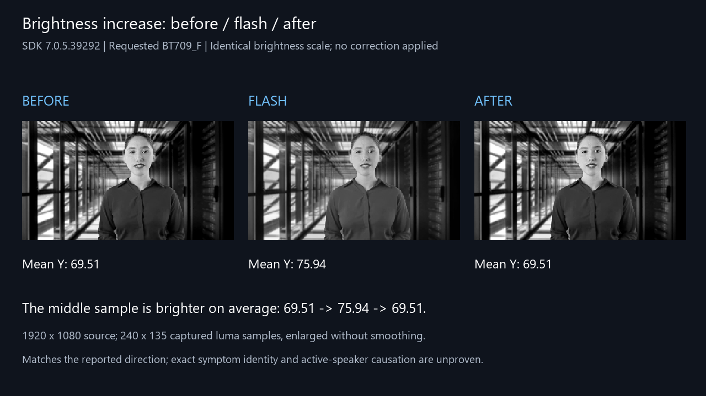
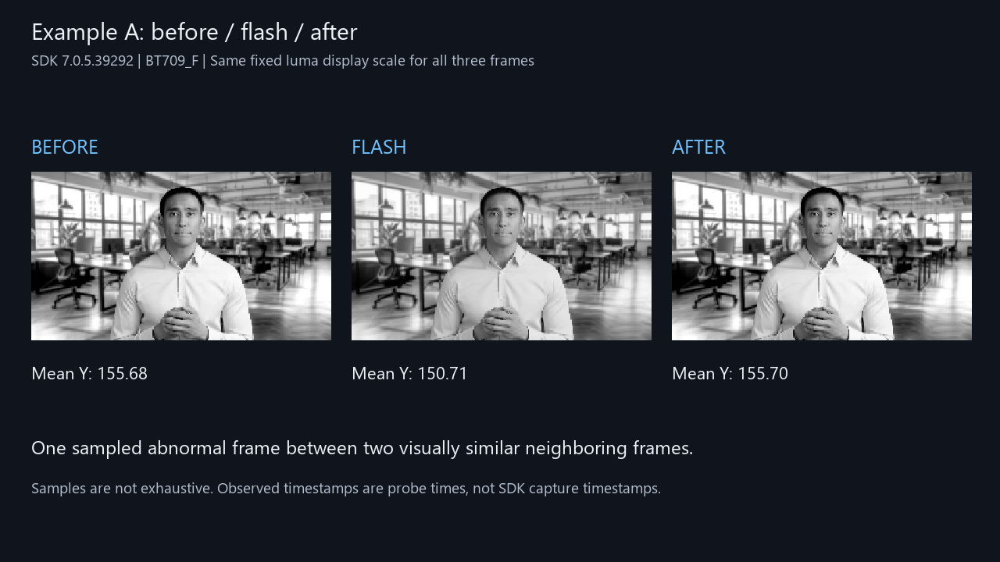
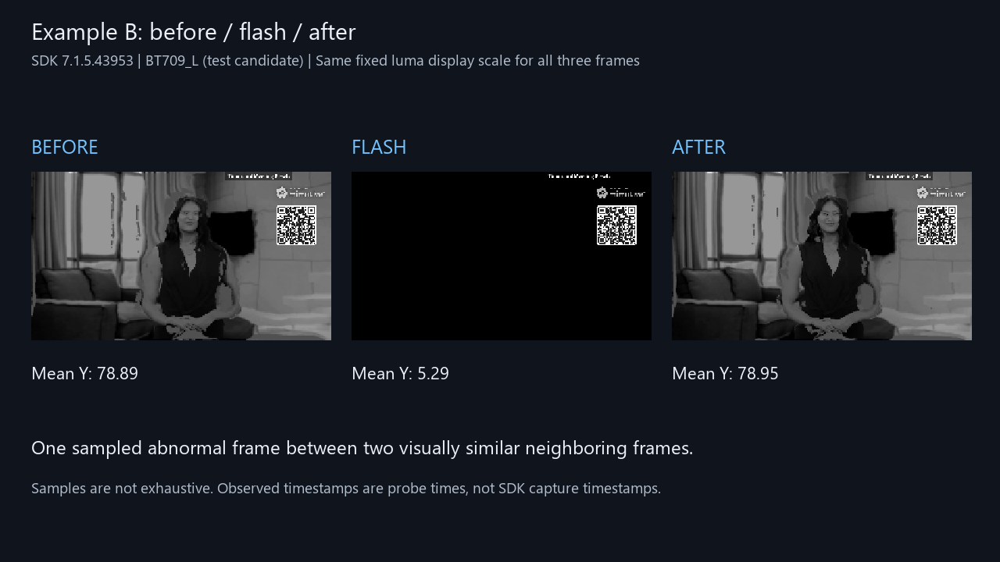

# Zoom Meeting SDK: intermittent video artifacts

Captured in CoreVideo Pro on Windows, September 22, 2026. Investigation: [#582](https://github.com/iamfatness/CoreVideoPro/issues/582).

These are **actual sampled grayscale frames**, arranged **before → flash → after**. All three frames in each comparison use the same brightness scale. They were sampled from the helper's I420 output, after range normalization and before CoreVideo compositing. This is diagnostic evidence, not a screen recording or proof of a Zoom SDK defect.

## Reported symptom: brief brightness increase

**Correction:** The initial page led with darkening examples. Those did not demonstrate the operator's reported brightness increase and should not have been presented as if they did. The capture below matches the reported direction, although confirmation that it is the exact same visible symptom is still pending.

SDK **7.0.5.39292**, requested `BT709_F`, 1920x1080 source. Mean sampled luma **69.51 → 75.94 → 69.51**, with lifted dark areas in the middle sample. SHM sequences 2364 / 2366 / 2368. No brightness correction applied.

## Additional findings — not confirmed as the reported symptom

The following darkening artifacts were also captured. They may have different causes and do not establish the cause of the operator's brightness-increase report. The earlier video replay shows these additional findings, not the newly selected brightening example.

### 1. Brief contrast shift — SDK 7.0.5.39292

Requested `BT709_F`. One abnormal sampled frame between visually similar neighboring frames. Mean luma: **155.68 → 150.71 → 155.70**.

### 2. Severe dark frame — SDK 7.1.5.43953

Requested `BT709_L` in a test candidate built against matching SDK headers and libraries. Mean luma: **78.89 → 5.29 → 78.95**. A clean five-minute repeat caught this artifact after an earlier five-minute pass had no detections; the candidate was rejected.

## What we know

- Eight camera subscriptions; all reached 1080p in the five-minute comparisons. No quality downgrade or anomalous-frame suppression.
- Separate SDK-callback diagnostics observed an excursion in incoming Y samples while `IsLimitedI420()` stayed true. That trace is from a separate event, not Example 2's exact frame.
- Changing hardware receiving/processing settings separately did not eliminate the artifacts. Original settings were restored. No fix shipped.
- The operator notices flashes around active-speaker changes in Preview/multiview but has not noticed them in the ordinary Zoom client. Exact causation remains unproven.
- SDK input, sender content, decoder behavior, and SDK configuration still need to be isolated. Sampling was not exhaustive, and these two visual patterns may have different causes.

**Request for SDK engineering:** guidance on raw-video/decoder logging and a minimal reproduction configuration for intermittent luma excursions or dark frames with unchanged range metadata.

[Download all three images and corrected technical notes](CoreVideo-Zoom-SDK-images-and-notes.zip). No meeting credentials, audio, or unfiltered application logs are included.
